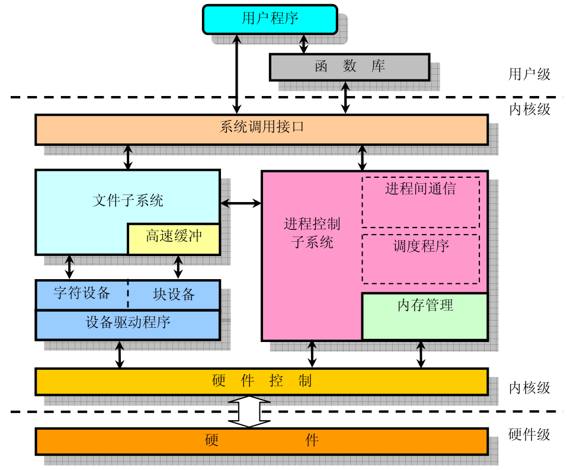
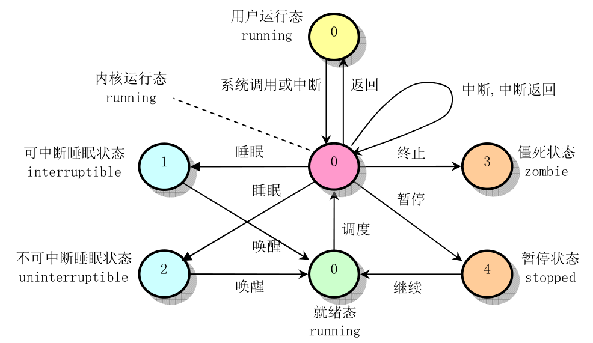
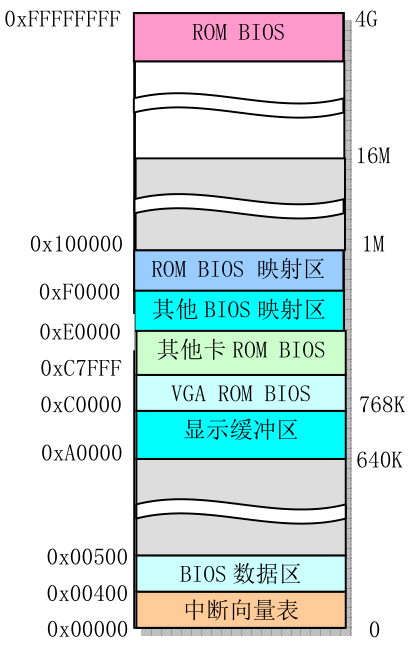
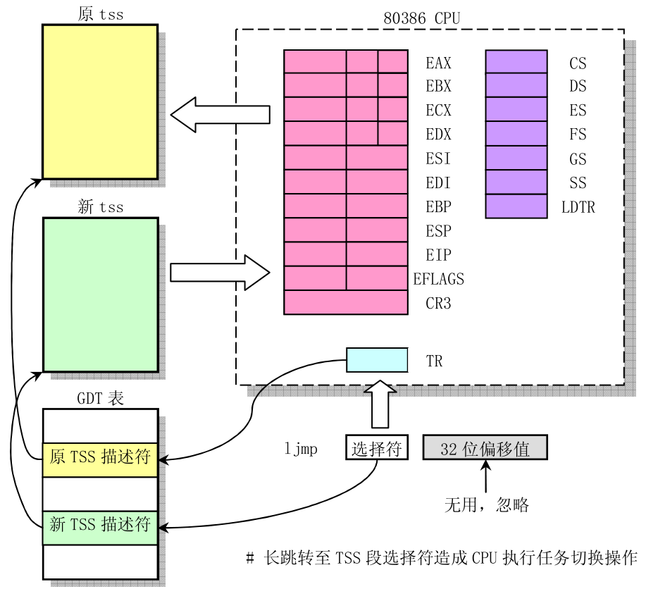
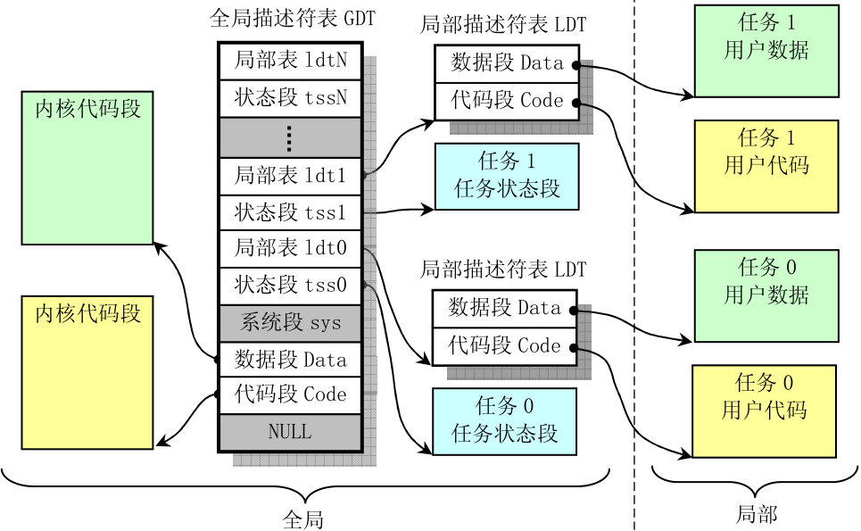
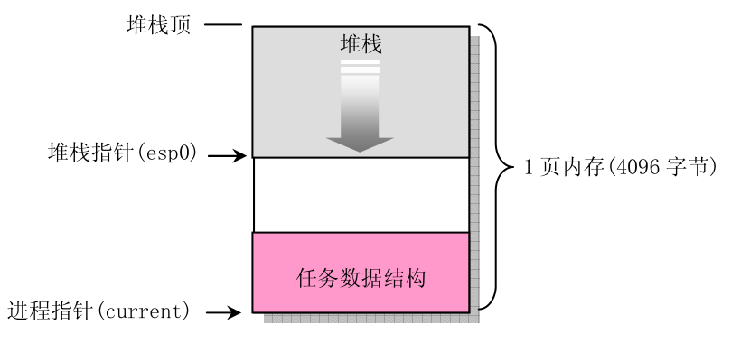
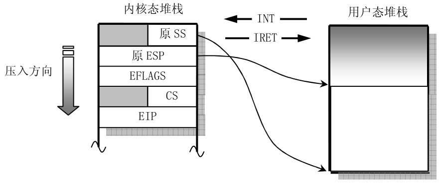

# linux 进程控制

> 对于 Linux0.11 内核而言，只支持 64 个进程，且 Linux 的内核堆栈和恶用户堆栈是分开的。用户堆栈用于存放进程在用户态下调用函数、局部变量等参数。

## 任务数据结构

内核程序徐通过进程表对进程进行管理，每个进程表项是一个 task_struct 任务结构(即 PCB)指针。

```c
struct task_struct
{
    long state;                     // 任务的运行状态，-1不可运行，0可运行，>0中止
    long counter;                   // 任务运行时间计数（时间片），递减
    long priority;                  // 运行优先数
    long signal;                    // 信号
    struct sigaction sigaction[32]; // 信号属性结构
    long blocked;                   // 屏蔽码
    int exit_code;                  // 执行停止的退出码
    unsigned long start_code;       // 代码段地址
    unsigned long end_code;         // 代码段长度
    unsigned long end_data;         // 代码长度+数据长度
    unsigned long brk;              // 总长度
    unsigned long start_stack;      // 堆栈段地址
    long pid;                   // 进程号
    long father;                    // 父进程号
    long pgrp;                      // 父进程组号
    long session;                   // 会话号
    long leader;                    // 会话首领
    unsigned short uid;             // 用户id
    unsigned short euid;            // 有效用户id
    unsigned short suid;            // 保存的用户id
    unsigned short gid;             // 组id
    unsigned short egid;            // 有效组id
    unsigned short sgid;            // 保存的组id
    long alarm;                     // 报警定时值
    long utime;                     // 用户态运行时间
    long stime;                     // 系统态运行时间
    long cutime;                    // 子进程用户态运行时间
    long cstime;                    // 子进程系统态运行时间
    long start_time;                // 进程开始时刻
    unsigned short used_math;       // 标志是否使用了
    int tty;                        // 进程使用tty的设备号
    unsigned short umask;           // 文件创建属性屏蔽位
    struct m_inode *pwd;            // 当前工作目录i节点结构
    struct m_inode *root;           // 根目录i节点结构
    struct m_inode *executable;     // 执行文件i节点结构
    unsigned long close_on_exec;    // 执行时关闭文件句柄位图标志
    struct file *filp[NR_OPEN];     // 文件结构指针表
    struct desc_struct ldt[3];      // 任务局部指针表
    struct tss_struct tss;          // 进程的任务状态段信息结构
};
```

- 进程上下文: 一个进程执行时,CPU 的所有寄存器中的值、进程的状态以及堆栈中的内容被称为上下文.当发生进程调度时,将当前进程上下文保存在该进程的任务数据结构中.

## 进程运行状态



- 运行态/就绪态(0):等待运行和正在运行的进程均以 0 标识.
- 可中断睡眠态(1):进程处于等待系统中断或等待资源的状态,当条件满足时,会进入就绪态.
- 不可中断睡眠状态(2):该类型进程不能被中断类型唤醒,只能手动调用 wake_up()函数来唤醒.
- 僵死状态(3):已经停止运行,但其父进程还未询问状态的进程.
- 暂停状态(4):由外部干扰,接收到 SIGTOP、SIGTSTP、SIGTTIN、SIGTTOU 等信号时会进入暂停态,可以用 SIGCONT 信号让其进入就绪态.

> 只有在用户态才会接受中断,而在内核态进程间的切换中,只用当前进程结束或调用 sleep_on()等函数主动退出运行态是,才会发生进程切换.

## 进程初始化

过程：当 32 位 CPU 上电后，会先进入实模式，从地址 0xFFFF0(ROM-BIOS)开始执行 BIOS 检测程序并在物理地址 0 处初始化中断向量,此后将启动设备的第一个扇区读入内存 0x7C00 处,并跳转到该地址,之后进入保护模式执行系统初始化程序(进程 0).完成初始化后使用 move_to_user_mode 宏将当前进程由内核态(特权级 0)转为用户态(特权级 3).



## 进程切换



进程切换的任务由 switch_to()宏定义的汇编代码完成:

- 首先检查切换到的进程 ID 是否为当前进程 ID
- 将内核全局变量 current 置为新任务的指针
- 将当前所有寄存器状态保存至原 TSS(任务状态段)中,再将新 TSS 中的数据写入寄存器中
- 开始执行新进程

## 终止进程

- 当一个程序需要终止时会调用 exit()系统调用,执行内核函数 do_exit()
- 先释放进程代码段和数据段在内存中的页面,关闭进程所有打开的文件
  - 若该进程有子进程,则将 init 进程(0 号进程)作为其所有子进程的父进程
  - 当子进程被终止并处于僵死状态,需要等到父进程使用 wait()或者 waitpid()来询问子进程状态才会死亡,父进程会把子进程的运行时间加到自己的进程中,释放已终止子进程所占的内存页面

# linux 内核对内存的使用

## 全局描述符表GDT和局部描述符表LDT



# linux中的堆栈

> Linux0.11共有使用了四种堆栈: 系统初始化临时使用的堆栈,内核堆栈(任务0的堆栈),内核态堆栈,用户态堆栈

## 任务的堆栈

### 用户态堆栈

### 内核态堆栈



一个进程的内核态堆栈位于其任务数据结构所在页面的末端,当一个任务进入内核态执行时,其内核堆栈总是空的.

### 任务内核态堆栈和用户态堆栈的切换



当一个用户态进程执行int程序后进入内核态,其内核态堆栈会记录用户态堆栈的栈顶和栈基地址.
